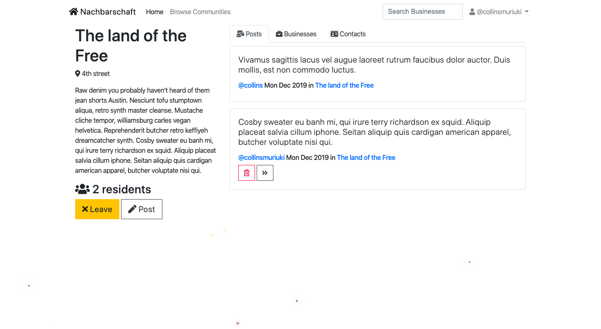

<h1 align="center">Welcome to Nachbarschaft 👋</h1>
<p>
  
  <a href="LICENSE" target="_blank">
    
  </a>
  <a href="https://twitter.com/collinsmuriuki_" target="_blank">
    
  </a>
</p>

> If you are like me, You really don’t know what is happening in your neighborhood most of the time. What if an important meeting happens, theft or even death wouldn’t you like to know about it.



## Technologies used

1. Python3
2. SQLite3
3. MDBootstrap 4.8.10
4. jQuery 3.4.1
5. Django 1.11.23
6. Javascript; canvas star effect credit goes to [Thibka](http://codepen.io/Thibka/pen/mWGxNj)

## Requirements

This project requires python3 to run
Instructions on how to install python can be found [here](https://realpython.com/installing-python/)

## Setting up a virtual environement

To create a virtual environement, you will need to install virtualenv
```sh
pip3 install virtualenv
```

Create the virtual environement by running the command in the project root
```sh
virtualenv venv
```

Activate the virtual environement by running the command
```sh
source venv/bin/activate
```

You can always deactivate the virtual environement by entering this command
```sh
deactivate
```

## Usage

Make migrations by using the command
```sh
python manage.py migrate
```

You need to create a .env file and set your secret key inside it. To launch the app, simply run the command
```sh
 python manage.py runserver
```

## Run tests

```sh
python manage.py test
```

## Author

👤 **Collins Muriuki**

* Twitter: [@collinsmuriuki_](https://twitter.com/collinsmuriuki_)
* Github: [@collinsmuriuki](https://github.com/collinsmuriuki)

## Show your support

Give a ⭐️ if this project helped you!

## 📝 License

Copyright © 2019 [Collins Muriuki](https://github.com/collinsmuriuki).<br />
This project is [GNU General Public License v3.0](LICENSE) licensed.

***
_This README was generated with ❤️ by [readme-md-generator](https://github.com/kefranabg/readme-md-generator)_